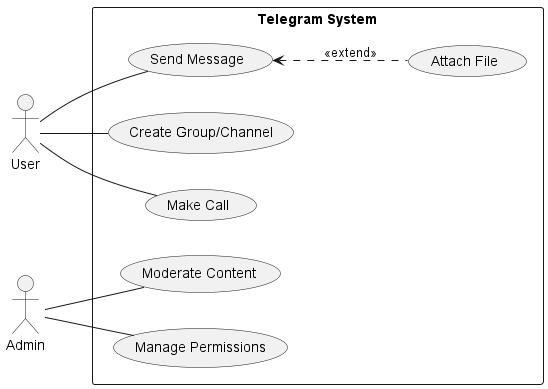
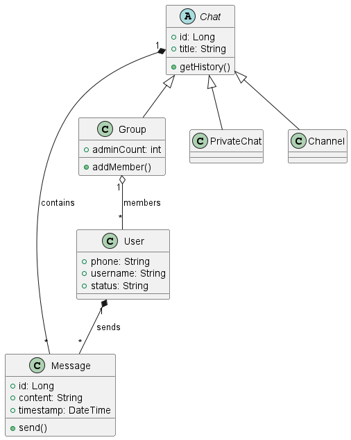
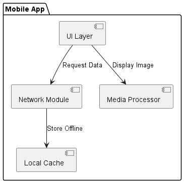
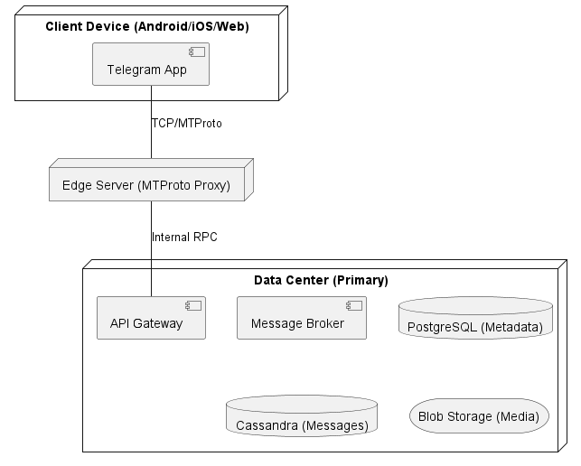
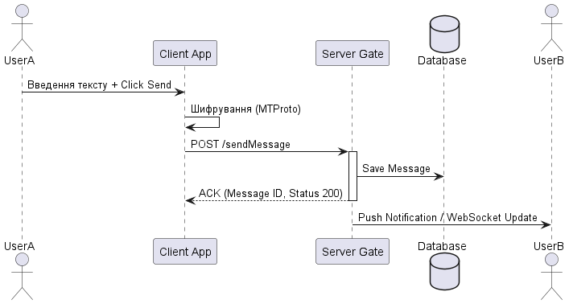
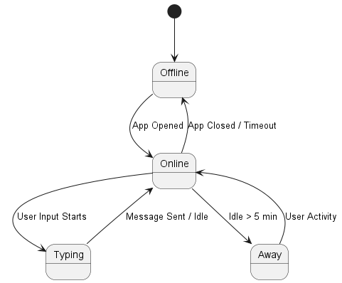
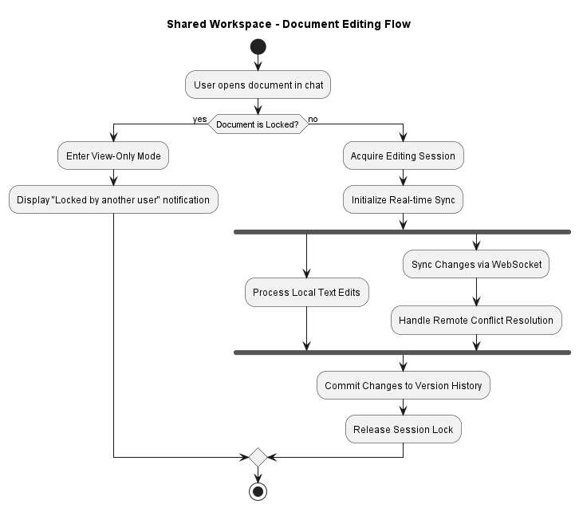

# Звіт з моделювання предметної області: Месенджер (на прикладі Telegram)

Цей документ містить опис предметної області, глосарій та візуалізацію архітектурних рішень проєкту.

---

## 1. Глосарій предметної області

* **Користувач (User):** Основний актор системи, що має унікальний ідентифікатор, номер телефону, ім'я (username) та поточний статус мережевої активності.
* **Чат (Chat):** Абстрактна сутність для комунікації, яка може реалізовуватися як приватний чат (PrivateChat), група (Group) або канал (Channel).
* **Повідомлення (Message):** Базова одиниця інформації, що містить текст або медіа, має унікальний ID та часову мітку (timestamp).
* **MTProto:** Спеціалізований криптографічний протокол, який використовується для безпечної взаємодії між клієнтським застосунком та серверами Telegram.
* **API Gateway / Server Gate:** Точка входу на стороні сервера, що приймає запити від клієнтів (наприклад, `POST /sendMessage`).
* **Shared Workspace:** Запропонована нова функціональність, що дозволяє користувачам спільно редагувати документи безпосередньо в чаті.

---

## 2. UML-моделювання системи

### 2.1 Діаграма прецедентів (Use Case Diagram)

**Опис:** Визначає межі системи та її функціональність для користувача. Основні дії включають надсилання повідомлень, створення груп, дзвінки, а також адміністрування та модерацію контенту.

### 2.2 Діаграма класів (Class Diagram)

**Опис:** Статична структура. Демонструє ієрархію чатів (`PrivateChat`, `Group`, `Channel`), сутність користувача (`User`) та повідомлення (`Message`), а також зв'язки та агрегацію між ними.

### 2.3 Діаграма компонентів (Component Diagram)

**Опис:** Внутрішня організація мобільного застосунку. Показує взаємодію між UI-шаром, мережевим модулем, локальним кешем для роботи в офлайн-режимі та обробником медіа.

### 2.4 Діаграма розгортання (Deployment Diagram)

**Опис:** Фізичне розгортання. Розподіл компонентів між клієнтським пристроєм, проміжним сервером (Edge Server/Proxy) та основним дата-центром зі сховищами даних (PostgreSQL, Cassandra).

### 2.5 Діаграма послідовностей (Sequence Diagram)

**Опис:** Потік повідомлень під час надсилання тексту. Включає взаємодію між застосунком, сервером, збереження в БД та доставку отримувачу через WebSocket або Push-сповіщення.

### 2.6 Діаграма станів (State Diagram)

**Опис:** Життєвий цикл активності користувача. Відображає переходи статусів мережевої присутності між `Offline`, `Online`, `Typing` та `Away`.

### 2.7 Діаграма діяльностей (Activity Diagram)

**Опис:** Алгоритм роботи функції спільного редагування документів (Shared Workspace). Включає паралельні процеси (fork/join) для локального редагування та синхронізації змін у реальному часі.

