# 📊 UML Жарти та Життєві Ситуації

Цей документ містить колекцію жартівливих UML-діаграм, які описують нетехнічні та життєві ситуації: від програмування та навчання до спорту і побуту. 

### 1. Exam Situation
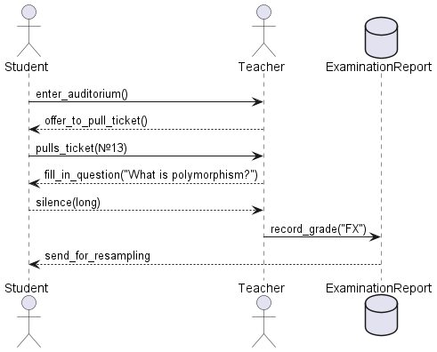

### 2. Shopping Logic
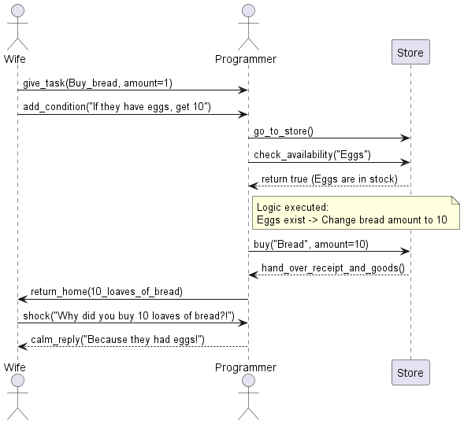

### 3. Alarm Struggle
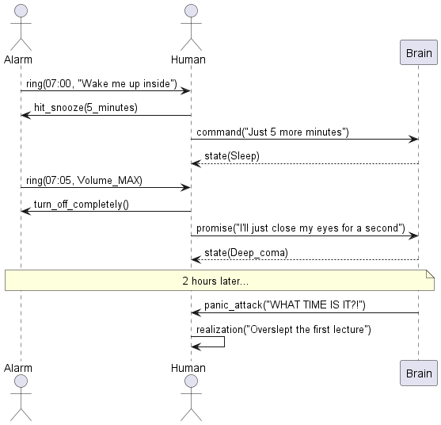

### 4. 3 AM Cat
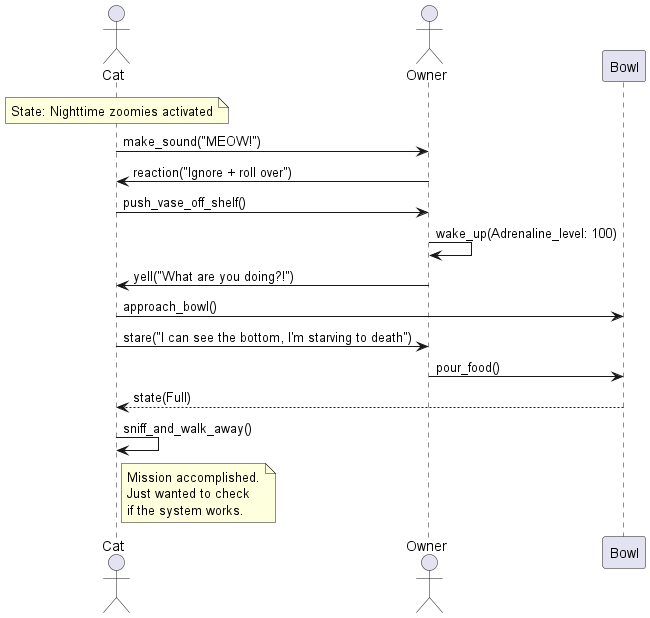

### 5. Friday Deploy
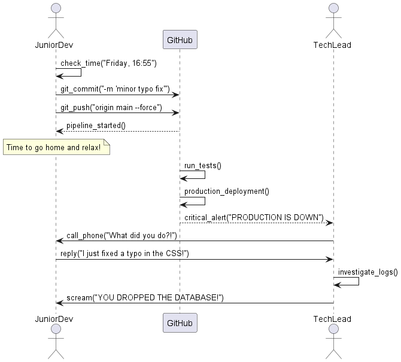

### 6. IKEA Assembly
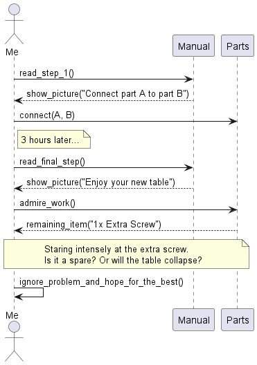

### 7. PR Decisionlarm Struggle
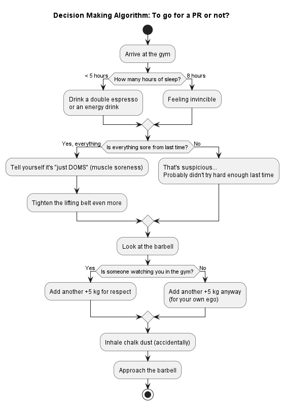

### 8. Gym Ecosystem
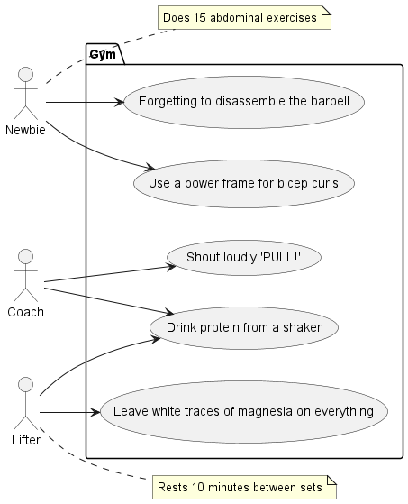

### 9. 2 AM Anatomy
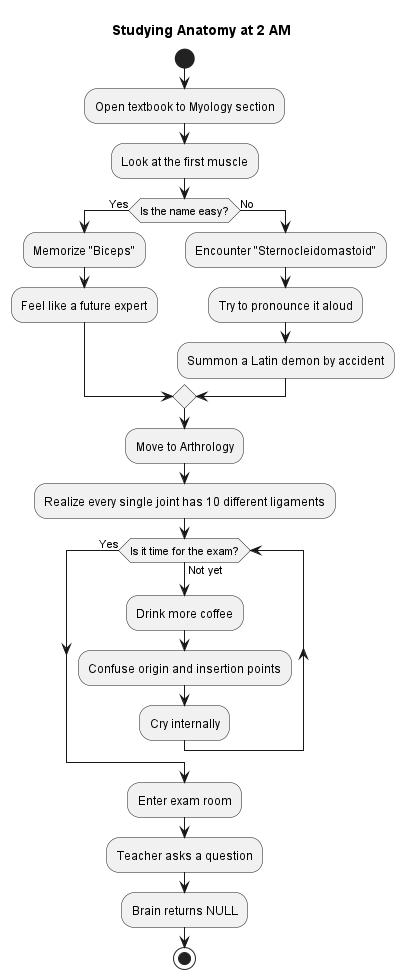

### 10. Infinite Loop
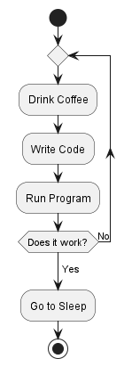

### 11. Software Engineering Dilemma
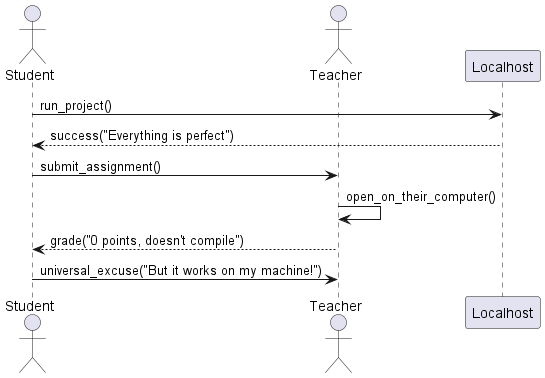
